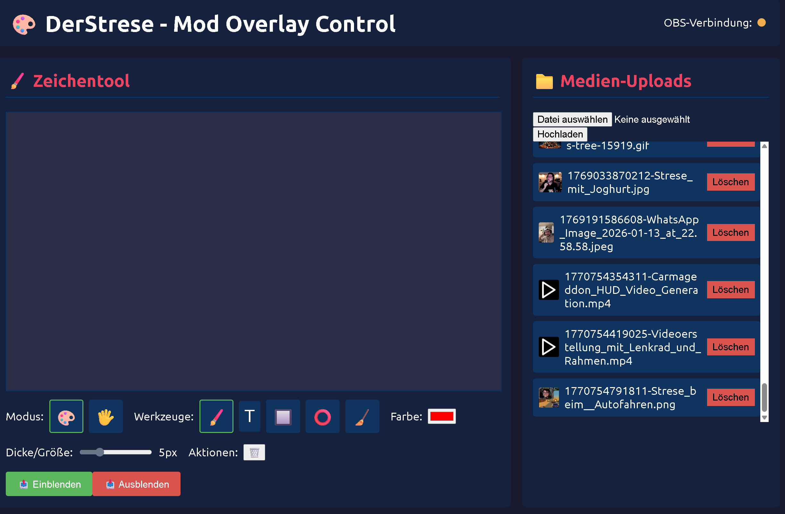
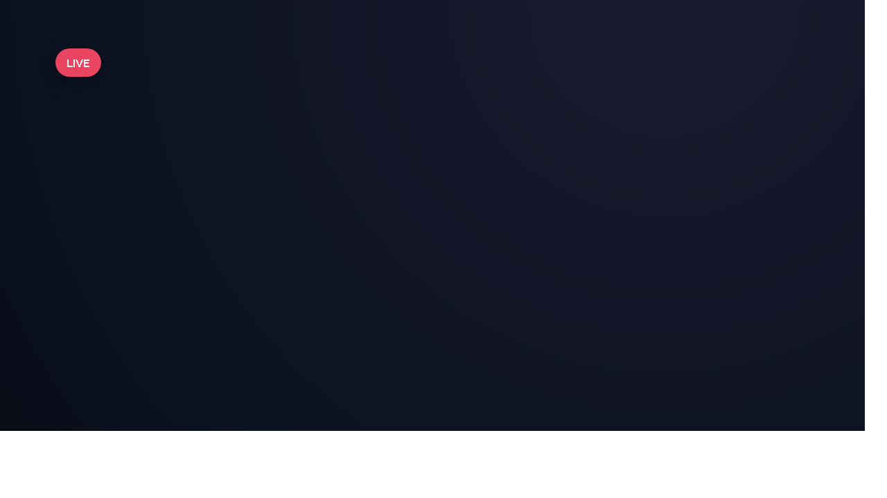
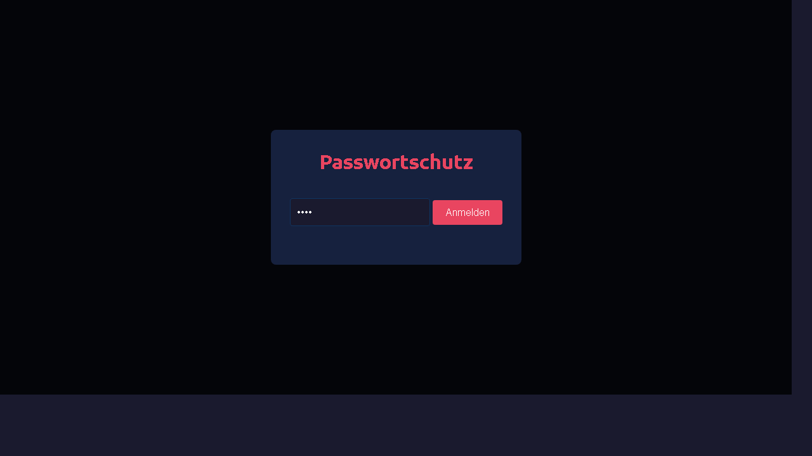

# stream-overlay-system

Remote overlay control system for Twitch/YouTube streams. Provides a password-protected mod UI to draw, place text/shapes, and manage media uploads, plus a lightweight overlay display for OBS Browser Sources.

## Preview

## Features
- Password-protected mod control UI per streamer
- Drawing tools: brush, text, rectangles, circles, eraser; edit mode
- Upload and manage images/videos
- Realtime updates via Socket.IO
- Simple OBS integration via Browser Source

## Setup
1. `npm install`
2. `npm start`

Server runs on `http://localhost:5004`.

## Configuration
- Set streamer IDs and passwords in `server.js` (the `DEFAULT_PASSWORDS` object) or via `PASSWORDS_JSON`.
- Change the port with `PORT` (default `5004`).
- If you run behind a reverse proxy (Nginx), set `TRUST_PROXY=1`.

Environment example:
`PORT=3000 PASSWORDS_JSON='{"derstrese":"2627"}' TRUST_PROXY=1 node server.js`

## Deployment (Hetzner)
This repo includes a ready-to-use `cloud-init.yaml` that installs Node.js, Nginx, PM2, and configures TLS.

1. Open `cloud-init.yaml` and update: `DOMAIN`, `EMAIL`, `STREAMER_ID`, `PASSWORDS_JSON`, and the `ssh_import_id` GitHub user (optional).
2. Create a Hetzner Cloud server (Ubuntu 24.04) and paste the file into cloud-init.
3. Point your DNS A record for `DOMAIN` to the server IP.
4. After boot, open the Mod UI: `https://DOMAIN/<streamerId>/modoverlay`.
5. In OBS, use the overlay URL: `https://DOMAIN/<streamerId>/overlay-display`.

Operations:
- Update: `cd ~/stream-overlay-system && git pull && pm2 restart stream-overlay`
- Logs: `pm2 logs stream-overlay`

## Usage
- Mod UI: `http://localhost:5004/<streamerId>/modoverlay`
- Overlay display: `http://localhost:5004/<streamerId>/overlay-display`

In OBS, add a Browser Source pointing to the overlay display URL.

## API
- `POST /api/auth` (body: `streamerId`, `password`)
- `POST /api/upload/:streamerId` (multipart `mediaFile`)
- `GET /api/media/:streamerId`
- `DELETE /api/media/:streamerId/:filename`
